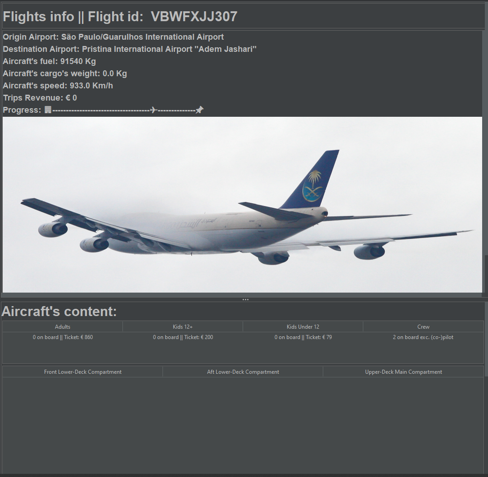
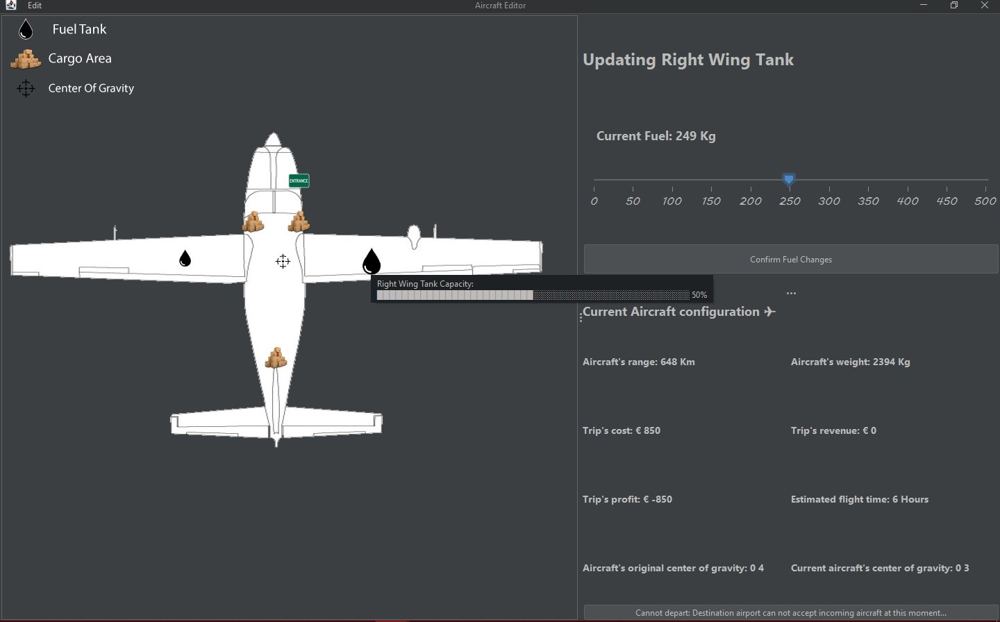

# Mohammad Al Shakoush s4274865 & Dominic Therattil (s4228952)

## Hi, in this short overview you will be informed on what is changed/added and what you can expect.

### Table of contents :

- [Main Upgrades](#mainupgrades)
  - [TRIPS](#trips)
    - [The trips info panel](#the-trips-info-panel)
    - [Close up of info panel](#close-up)
- [Aircraft Editor](#editor-frame)
  * [Not reachable notification](#not-reachable-notification)
  * [Fuel tank selected](#fuel-tank-selected)
  * [Cargo area selected](#cargo-area-selected)
  * [Quick Info](#quick-info)
- [Improvments](#upgrades-and-updates)
  * [Adding passengers on board](#passengers)
  * [DLC](#dlc)
  * [Perfect un/re do](#manager)

<a name = "mainupgrades">
<a name = "trips">
  
## TRIPS
The main focus was adding flights/trips. After pressing 'depart' a dot shows on the world map. `Green dots in the picture`  
    

These dots will move to the chosen destination airport. The rate of which the dots moves is chosen by the user through a 'JSpinner'.
>Each type of aircraft has its own speed or "rate" at which it moves across the map. This was decided by the help of cruise speed of the aircraft. This way the boeing 747 is faster than the 737. When adjusting the `JSpinner` the rate changes accordingly.

The dots/trips are select-able. When selected, the steps taken so far are painted and the new panel is shown. This panel views real time fuel status and the progress of the
trips. Of course some more info about trip itself and the content of the aircraft. In addition to a cool randomized image (dependent on type of aircraft).
     
## The trips info panel
     
## Close up:
      
  > note: here the progess bar with the `✈` and the fuel amount upgrade in real time

# Editor Frame

## Not reachable notification
  At the main frame, added a notification message telling the user that they will never reach their selected destination even with fully loaded fuel tanks (if applicable). However,
  the user still has the choice to configure the aircraft.
   

Next picture is the Aircraft Editor from the assignments F.L.A.P.S. I changed two things here for this competition.
We went for a slick design and decided to show the user the reason for no being able to depart on the button depart itself which is much better than a pop up.
     
## Fuel tank selected
     
## Cargo area selected
     
  >As you can see the button 'view import demands' shows the import demands of the destination airport so the user can choose the best options.
  
  >Upon updating the slider and confirming a change, the slider data for the other cargo units updates dynamically, this provides the user with more informative data.

# Upgrades and Updates

* ### Quick Info
     
  >Hovering over the different points on the airplane map enables the user to view some quick information regarding the capacity of that area. 

<a name = "passengers">
  
* ### Adding Passengers
     
  What I added is that the passengers from each category now get a randomized price for the ticket. Adults always have to pay more than 12+ and the latter more than 12-.
  Of course the sum of theses tickets is added to the profit and the weight of the passengers.
   
* ### DLC
   Added the DLC airports and aircrafts with passenger functionality.
  
 <a name = "manager">
   
* ### Undo/Redo manager
   The un/re do manager is now perfected. Previously the manager was initiated when the editor frame was opened. Now however each aircraft that gets selected gets its own
   manager. This way you can still undo previous action taken even after closing the configuration frame of the aircraft. In addition to the fact that the program now jumps
   back to the right configuration panel (cargo, fuel, passengers) and the exact previously selected point is re selected.
  >When the aircraft departs its manager and edit menu get deleted
