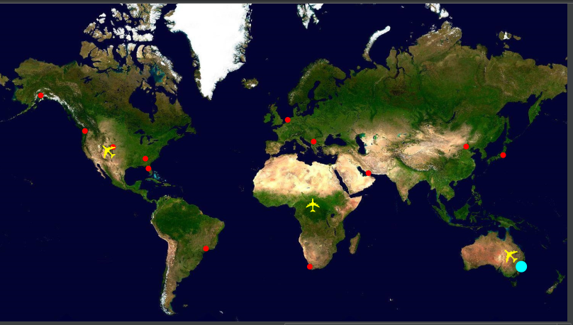
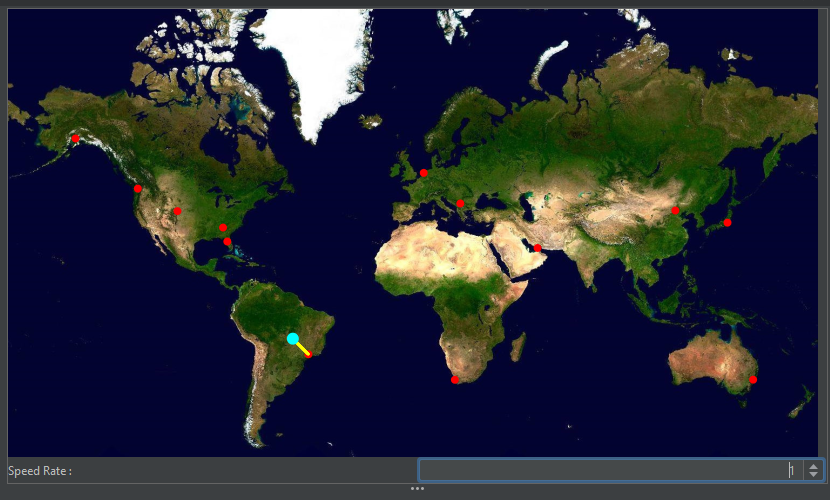
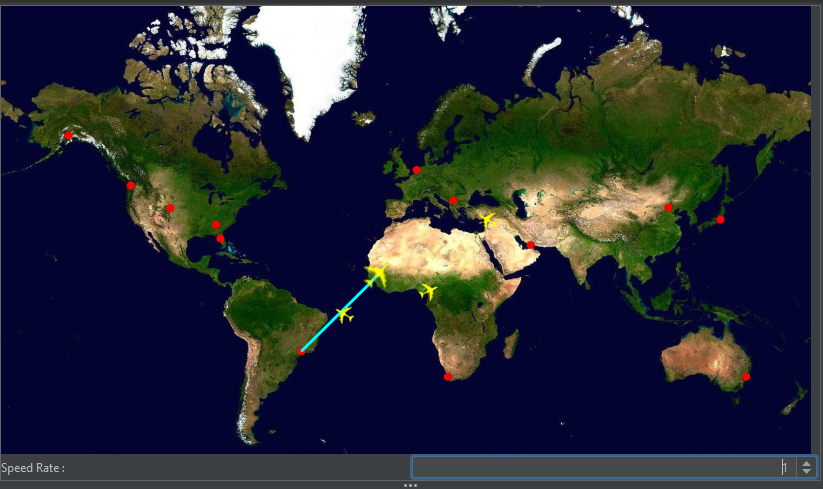
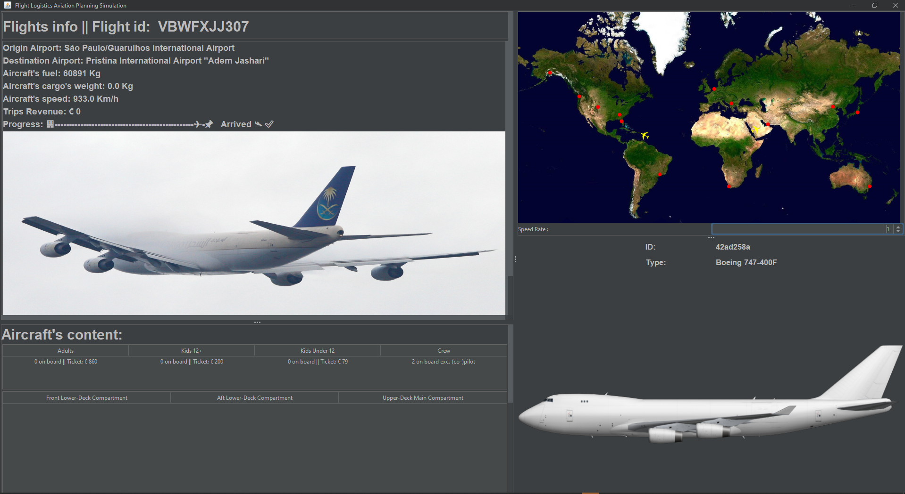
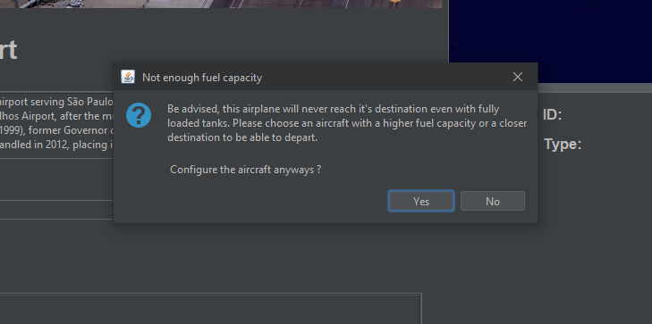
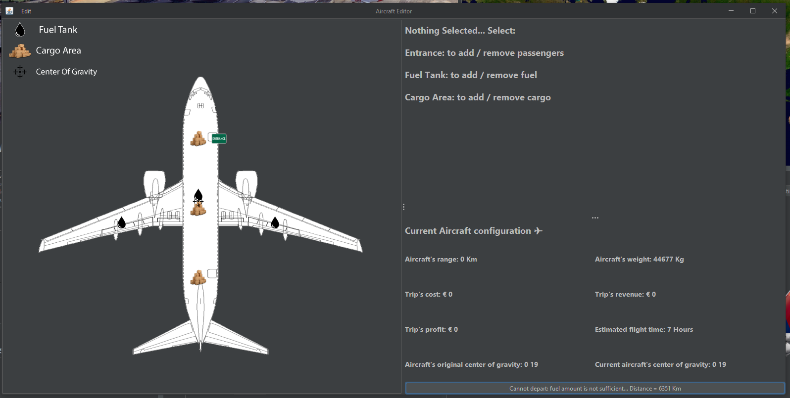
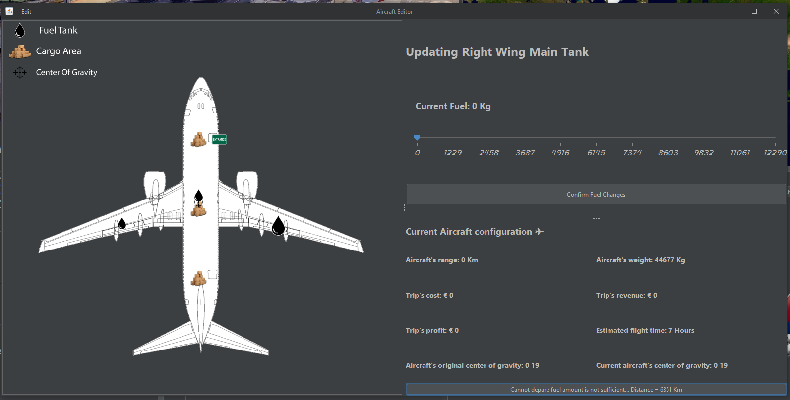
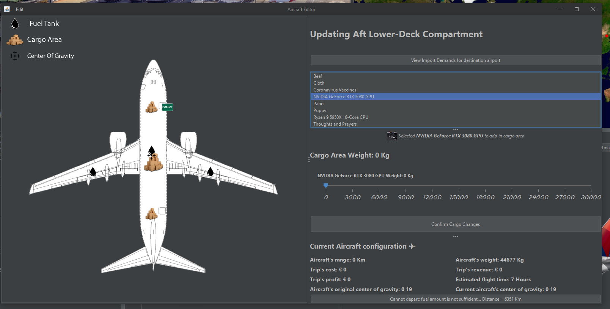
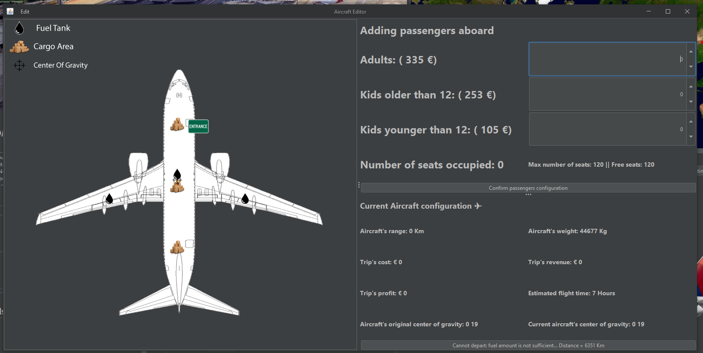

### Mohammad Al Shakoush s4274865

## Hi in this short overview I will inform you on what I have done and you can expect.

# TRIPS
The main focuse was adding flights/trips. After pressing `deprat` a dot shows on the world map.  
    

These dots will move to the chosen destination airport. The rate of which the dots moves is chosen by the user through a `JSpinner`. But set as 100ms at first.
    

The dots/trips are selectable. When selected the, the steps taken so far are patinted and the new panel is shown. This panel views real time fuel status and the progress of the 
trips. Ofcourse some more info about trip itself and the content of the aircraft. In addition to a cool randomized image (dependent on type of aircraft).
   
The trips info panel
   

At the main frame, added a notification message telling the user that they will never reach their selected destination even with fully loaded fuel tanks (if applicable). However,
the user still has the choice to configure the aircraft.
   

Next picture is the Aircraft Editor from the assignements F.L.A.P.S. I changed two things here for this competition.
We went for a slick design and decided to show the user the reason for no being able to depart on the button depart itself which is much better than a popup.
   
This is how it looks when a fuel tank is selected :
   
This is how it looks when a cargo area is selected :
   
As you can see the button `view import demands` shows the import demands of the desntination airport so the user can choose the best options.

The things I added/changed :

* 1 : The passengers entrence (adding passengers on board)
   
  What I added is that the passengers from each category now get a randomzied pice for the ticket. Adults always have to pay more than 12+ and the latter more than 12-.
  Ofcourse the sum of theses tickets is added to the profit and the weight of the passengers.
* 2: The un/re do manager
  The un/re do manager is now perfected. Prevouisly the mager was initiated when the editor frame was opened. Now however each aircraft that gets selected gets its own manager.   This way you can still undo previous action taken even after closing the configration frame of the aircraft. In addition to the fact that the program now jumps back to the right configuration panel (cargo, fuel, passengers) and the exact previosly selected point is reselected.

